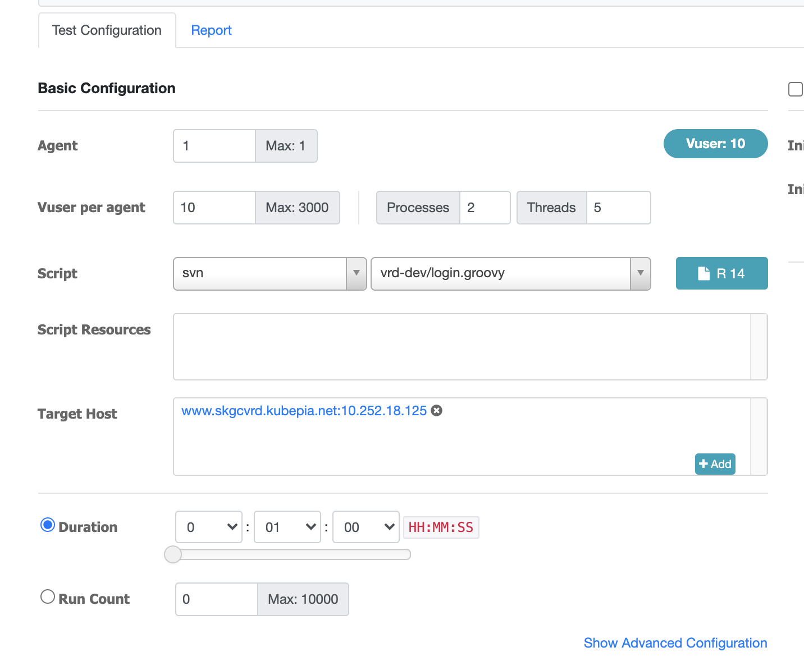

# perf-loader

## How to build

``` sh
sudo docker build -t skicr.azurecr.io/perf-ngrinder/agent:3.5.3 .
sudo docker build -t skicr.azurecr.io/perf-ngrinder/controller:3.5.3 .
```
## change ip of controller in __agent.conf
```
common.start_mode=agent
agent.controller_host=10.242.17.133
agent.controller_port=16001
agent.region=NONE
```

# How to run controller

```sh
docker run -d \
  -v $(pwd)/controller:/opt/ngrinder-controller \
  --name controller \
  -p 80:80 -p 16001:16001 \
  -p 12000-12009:12000-12009 \
  --add-host skgcvrd.kubepia.net:10.22.18.125 \
  --add-host www.skgcvrd.kubepia.net:10.22.18.125 \
  skicr.azurecr.io/perf-ngrinder/controller:3.5.3
```

## How to run agent

change configuration for agent.conf file in __agent.conf

``` sh
sudo docker run -d \
  -v $(pwd)/__agent.conf:/agent/ngrinder-agent/__agent.conf\
  --name agent01 \
  skicr.azurecr.io/perf-ngrinder/agent:3.5.3

sudo docker run -d \
  -v $(pwd)/__agent.conf:/agent/ngrinder-agent/__agent.conf\
  --name agent02 \
  skicr.azurecr.io/perf-ngrinder/agent:3.5.3

sudo docker run -d \
  -v $(pwd)/__agent.conf:/agent/ngrinder-agent/__agent.conf\
  --name agent03 \
  skicr.azurecr.io/perf-ngrinder/agent:3.5.3
```

## Target IP 변경방법

